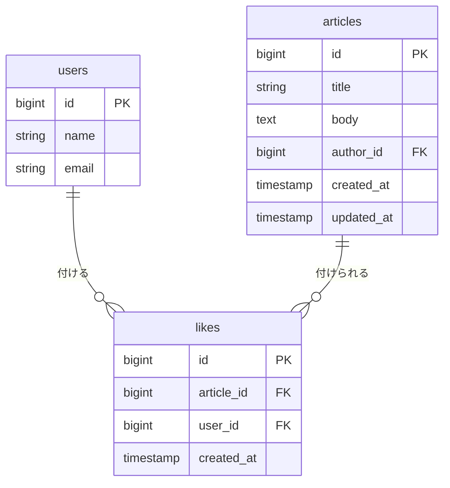
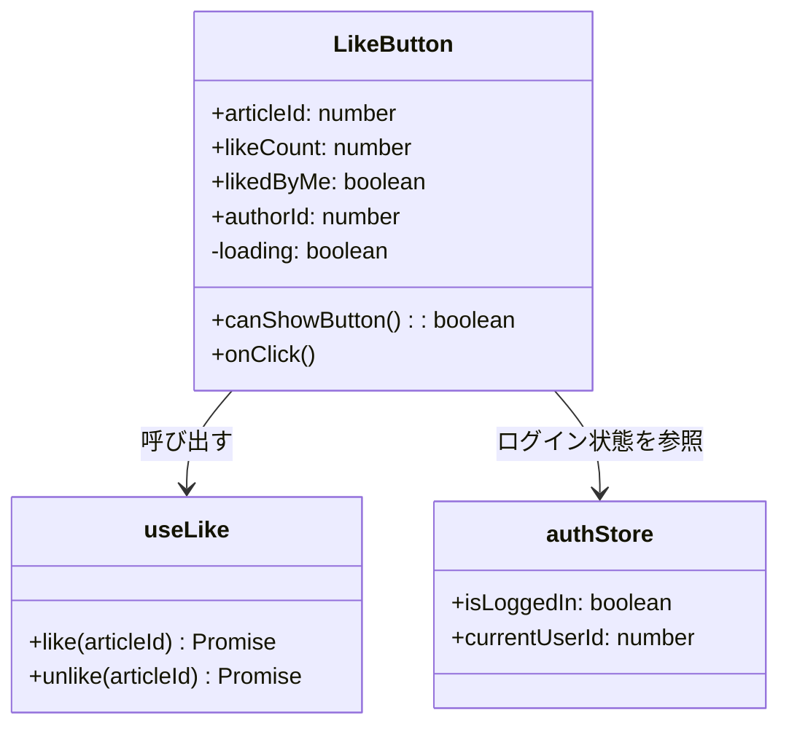
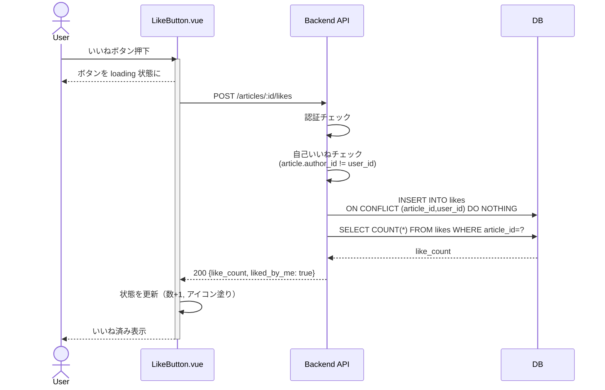
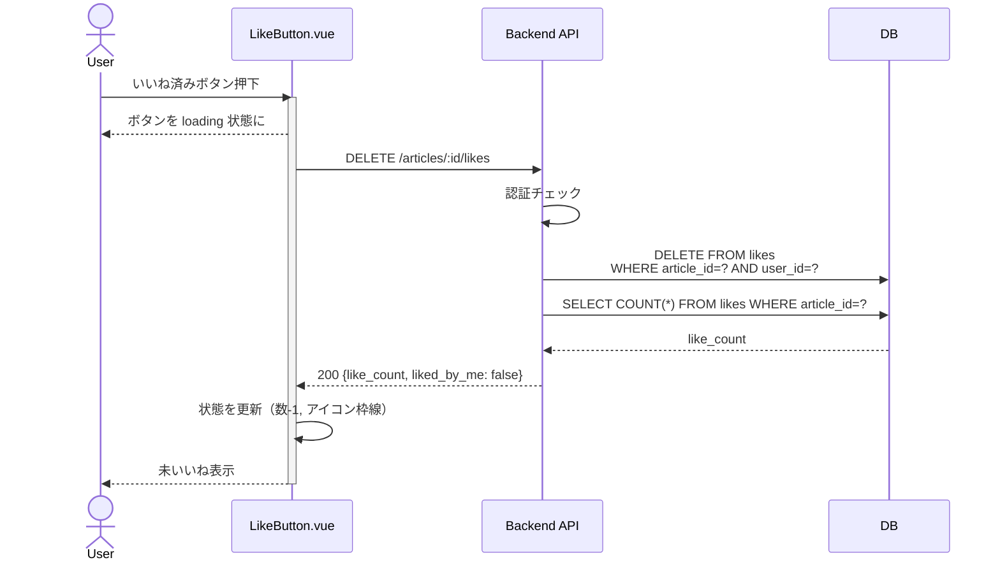
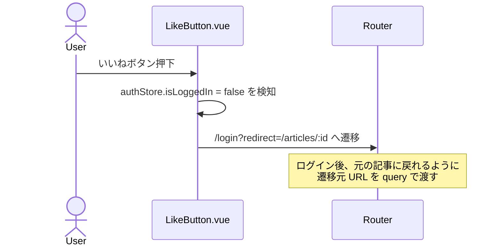
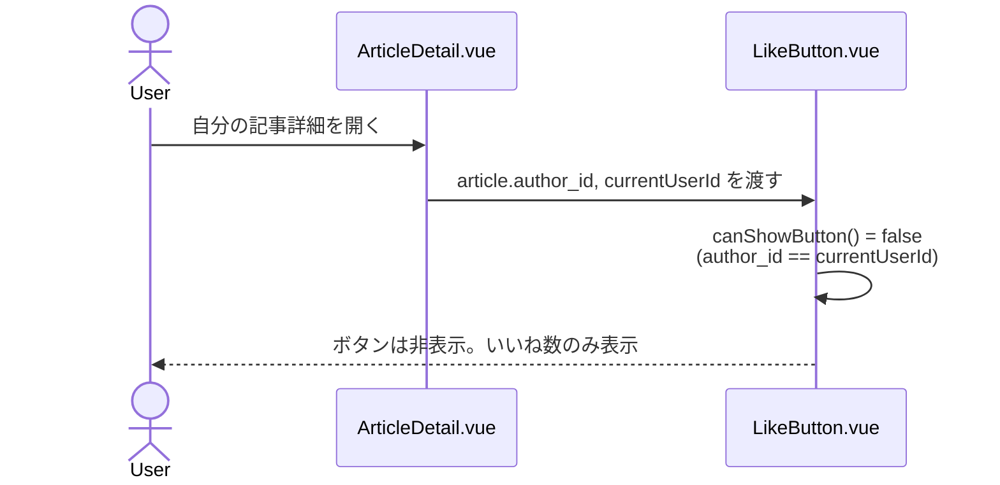

# 記事いいね機能 要件定義

## 概要 PBI #6

投稿者として自分の書いた記事への評価を知りたい。自分の記事の正確さや他者にわかりやすく伝わっているかを知って参考にしたいからだ。

## ゴール

- 記事詳細ページに「いいねボタン」と「いいね数」を表示する
- 記事一覧ページの各記事に「いいね数」を表示する
- ログインユーザーは記事に対していいねを付けたり外したりできる（トグル）
- 未ログインユーザーがいいねボタンを押すとログイン画面に誘導する
- 自分が投稿した記事には自分でいいねできない

## ノンゴール

- 回答（Reply）へのいいね・高評価（PBI #8 で対応予定）
- 自分がいいねした記事の一覧表示（マイページ機能）
- 「誰がいいねしたか」のユーザー一覧表示
- 通知機能（投稿者へ「○○さんがいいねしました」を伝える等）
- いいね数による記事一覧の並び替え（人気順ソート）
- ランキング・表彰機能

## 用語

`Like` エンティティ（テーブル `likes` / 型 `Like`）はユーザーが記事に付けた評価を1件ずつ表す。

| 用語         | 説明                                                                       |
| ------------ | -------------------------------------------------------------------------- |
| いいね       | ユーザーが記事に付ける評価。1ユーザーにつき1記事1件まで                    |
| いいね数     | 記事に付けられたいいねの総数                                               |
| いいね済み   | 閲覧中のログインユーザーが対象記事にすでにいいねを付けている状態           |

**理由：** PBI #8（回答への評価）も類似の構造になるが、対象が `articles` か `replies` かでテーブル設計が変わる。今回は記事専用に `likes` テーブルを切り、将来 PBI #8 で `reply_likes` のような別テーブルを追加する想定。汎用的な「対象種別カラム付き多態テーブル」は外部キー制約が効かなくなりバグの温床になりやすいので避ける。

## 画面要件

### 記事詳細ページ

記事本文の下部、コメント（リプライ）セクションの上に「いいね操作エリア」を配置する。

| 状態                       | 表示                                                                |
| -------------------------- | ------------------------------------------------------------------- |
| 未ログイン                 | アイコンは塗りなし。クリックでログイン画面へ遷移                    |
| ログイン済み・未いいね     | アイコンは塗りなし。クリックでいいね（数 +1）                       |
| ログイン済み・いいね済み   | アイコンは塗りあり（強調色）。クリックで取り消し（数 -1）           |
| 自分の記事                 | ボタン自体を非表示にし、いいね数だけを表示する                      |

**理由：** 自分の記事には自分でいいねできない仕様なので、押せないボタンを残すより非表示のほうが UI がシンプル。disabled で残すと「なぜ押せないのか」をツールチップで補う必要が出てしまう。

### 記事一覧ページ

各記事カードに「いいね数」を数値とアイコンで表示する。一覧画面ではいいねの操作はできず、表示のみとする。

**理由：** 一覧は「読みたい記事を探す」のが主目的なので、副作用のある操作（いいね付与）はカード内に置かない。誤タップで意図しないいいねが付くのを防げる。詳細に入ってから操作する導線にする。

### 状態

- 一覧取得中：既存のスケルトン表示の中にいいね数の枠も含める
- いいね送信中：ボタンを `v-btn :loading` でフィードバック
- エラー時：トーストで通知し、ボタンの見た目は元の状態に戻す
- 未ログイン時のクリック：ログイン画面へ遷移し、戻り先として記事 URL を query に持たせる

**理由：** いいねは1リクエスト完結の軽い操作なので、API 完了を待ってから UI を更新する **同期版** で実装する。Zenn / Qiita のような楽観的 UI 更新（先に画面を変えて失敗時にロールバック）は体感は軽快になるが、成功 / 失敗の両経路を扱う必要があり初学者チームではバグの温床になりやすい。応答時間が問題になってから移行する余地を残しておく。

## 技術方針

### コンポーネント構成

```text
src/features/likes/
├── LikeButton.vue        # いいねボタン本体。表示状態の判定とAPI呼び出し
└── composables/
    └── useLike.ts        # like / unlike のAPI呼び出しロジック
```

**理由：** ボタンは記事詳細以外（将来的にカードプレビュー等）でも再利用できるよう独立させる。状態管理を Pinia ストアにせずコンポーネント＋composable に閉じるのは、いいね状態は記事リソースに付随する値で、ストアでグローバルに持つ必要が薄いため。

### 自己いいねの防止

二重防衛で実装する：

- **フロント**：記事の `author_id` と現在ユーザーの `id` が一致するときボタン自体を描画しない
- **API**：記事の `author_id` と `user_id` が一致したら 400 を返す

**理由：** UI 制御だけだと API を直接叩かれたとき防げない。サーバ側のチェックは数行で済むため、コスト低くバグの温床にもなりにくい。

### いいね数・いいね済みフラグの取得戦略

記事の `like_count` と `liked_by_me` は **記事リソースのレスポンスに含める**。専用エンドポイントは設けない。

```jsonc
// GET /api/articles/:id, GET /api/articles のレスポンス（既存に追記）
{
  "id": 1,
  "title": "...",
  "like_count": 42,
  "liked_by_me": true   // 未ログイン時は常に false
}
```

**理由：** いいね数を別エンドポイントにすると、記事一覧で記事数ぶんのリクエストが必要になり N+1 になる。記事リソースの属性として返せば、一覧でも詳細でも追加リクエストなしに表示できる。サーバ側は `LEFT JOIN` または集計サブクエリで一発取得する。

### スタック

- Vuetify：ボタン・アイコン（`v-btn` + `mdi-heart` / `mdi-heart-outline`）
- Tailwind CSS：レイアウト
- axios：自動生成クライアント
- Pinia（既存の `auth` ストア）：ログイン状態と現在ユーザー ID の参照のみ

## データモデル（想定）

```ts
interface Like {
  id: number;
  article_id: number;
  user_id: number;
  created_at: string;
}

// 既存の Article 型に追加されるフィールド
interface Article {
  // 既存のフィールド...
  like_count: number;
  liked_by_me: boolean; // 未ログイン時は常に false
}
```

## API エンドポイント（想定）

| メソッド | パス                                  | 説明                            | 認証 |
| -------- | ------------------------------------- | ------------------------------- | ---- |
| POST     | `/api/articles/{article_id}/likes`    | 記事にいいねを付ける（冪等）    | 必須 |
| DELETE   | `/api/articles/{article_id}/likes`    | いいねを外す（冪等）            | 必須 |

成功時のレスポンスは共通で、更新後の状態を返す：

```jsonc
// 成功レスポンス（POST / DELETE 共通）
{
  "like_count": 43,
  "liked_by_me": true
}
```

サーバ側で以下を検証する：

- 認証必須。未ログインは 401 を返す
- POST：記事の `author_id` が現在ユーザーと一致したら 400 を返す（自己いいね禁止）
- POST：既にいいね済みなら DB に何も書き込まず 200 を返す（冪等）
- DELETE：いいね未登録なら何もせず 200 を返す（冪等）
- 対象の記事が存在しない場合は 404 を返す

**理由：** トグルを 1 エンドポイントにまとめる案もあるが、POST と DELETE を分けるほうが HTTP セマンティクスが明快で、ログを見たときも意図が読み取りやすい。冪等にしておけば二重クリックや通信再送の際もエラーにならず扱いやすい。

## ER 図



### DB 制約

```sql
ALTER TABLE likes
  ADD CONSTRAINT likes_article_user_unique
  UNIQUE (article_id, user_id);
```

| 制約       | 内容                                                                                          |
| ---------- | --------------------------------------------------------------------------------------------- |
| UNIQUE     | `(article_id, user_id)` の複合ユニーク。1 ユーザーが同じ記事に複数いいねを付けられない        |
| 外部キー   | `article_id → articles.id`（`ON DELETE CASCADE`）、`user_id → users.id`（`ON DELETE CASCADE`）|
| NOT NULL   | `article_id` / `user_id` は NOT NULL                                                          |

**理由：** UNIQUE を張れば「同じユーザーが同じ記事に複数いいねを残せる」というバグが DB 側で防げ、アプリ側の重複チェックが不要になる。`ON DELETE CASCADE` を入れておくと、記事や退会ユーザーが削除されたときに関連する `likes` 行が自動で消え、孤立行が残らない。

## クラス図（フロントエンドコンポーネント）



`LikeButton.canShowButton()` は「自分の記事ではない」場合に true を返す。未ログイン時は true（ボタンは表示し、押下でログイン誘導）。

## シーケンス図

### いいねを付ける（ログイン済み・未いいね）



### いいねを取り消す



### 未ログインユーザーがクリック



### 自分の記事を閲覧


