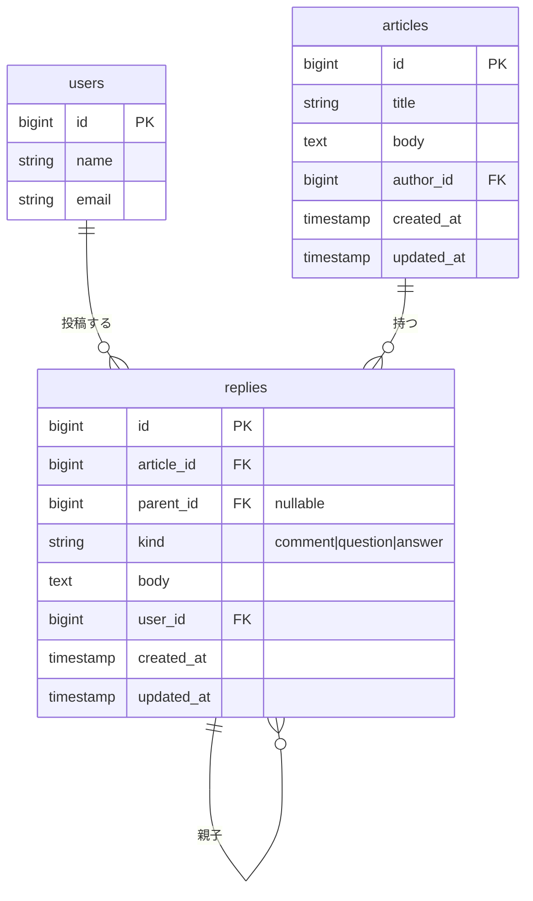
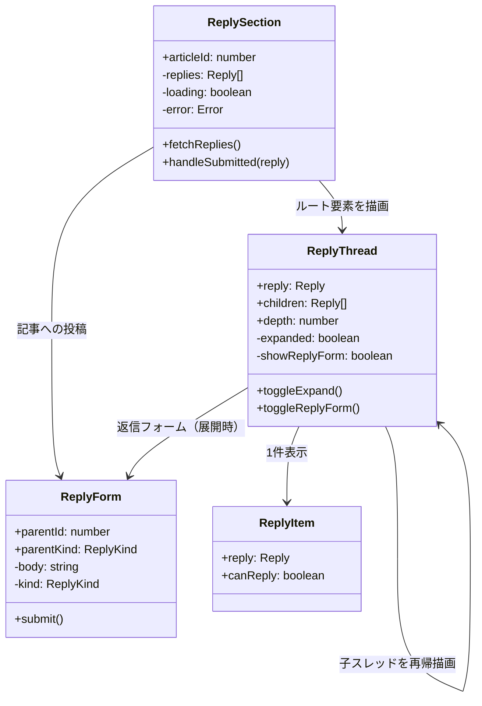
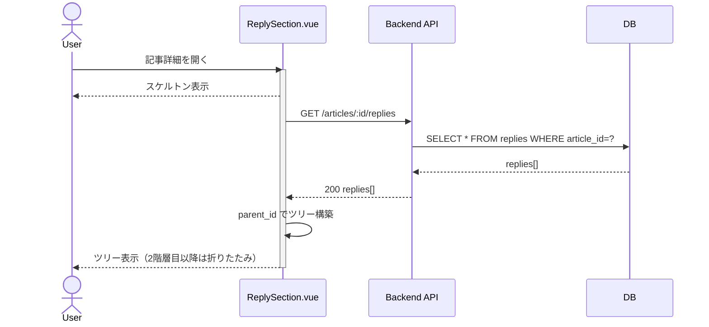
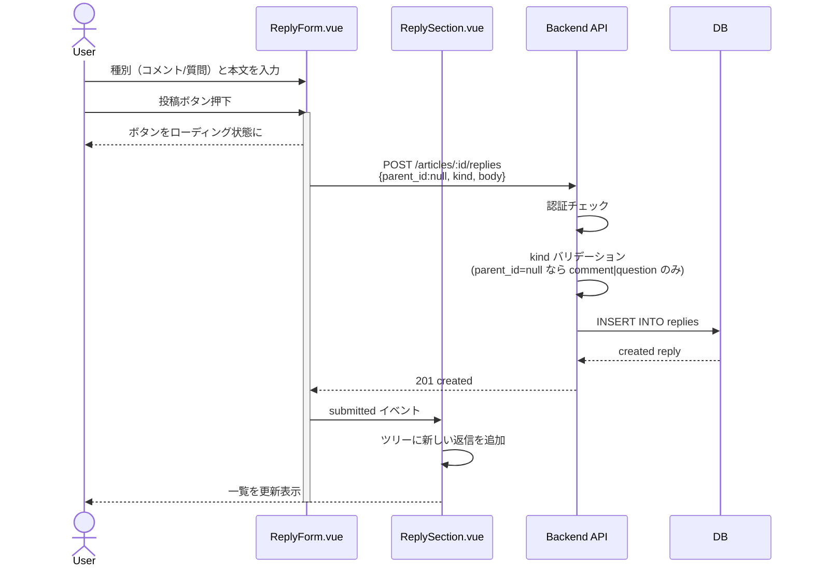
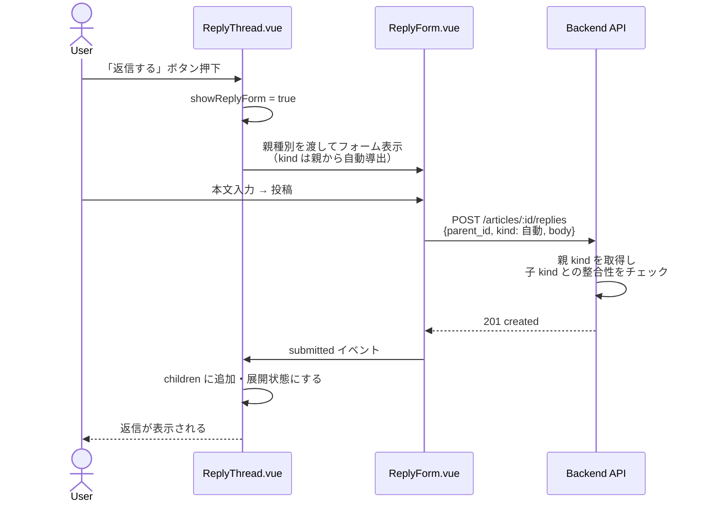
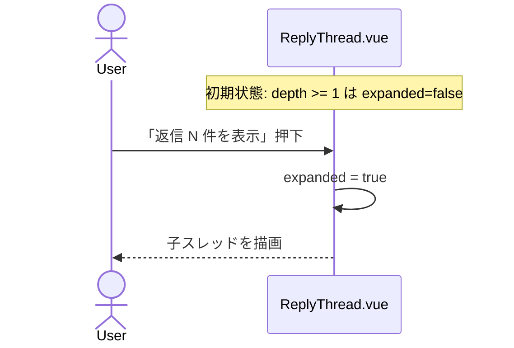

# 記事コメント(リプライ)機能 要件定義

## 概要 PBI #5

閲覧者として記事に対してコメントを書きたい。記事の内容について質問や指摘をしたいからだ。

## ゴール

- 記事詳細ページの下部にコメント一覧を表示する
- 記事に対して **コメント** または **質問** を投稿できる（ログインユーザーのみ）
- 既存のコメント / 質問 / 回答に対して返信を重ねられる
- 種別ごとにルールに従って返信できる種別が制限される
- 2 階層目以降の返信は折りたたんで表示する

## ノンゴール

- 投稿の編集・削除
- 本文のマークダウン記法
- いいね・評価機能（PBI #6, #8 で対応予定）
- 投稿者プロフィール表示（PBI #9 で対応予定）
- 質問への「ベストアンサー」選択
- 通知機能
- 検索・フィルタ
- ページネーション（初期は全件一括取得）

## 用語

`Reply` エンティティ（テーブル `replies` / 型 `Reply`）は記事に紐づくすべての発言を表す。日本語圏の「リプ欄 / リプライ欄」が記事への発言全般を指す語感に合わせ、エンティティ名は `Reply` を採用する。1 件ごとに `kind` を持ち、以下 3 種類のいずれか。

| 用語（UI 表示） | `kind` 値  | 意味                                                  |
| --------------- | ---------- | ----------------------------------------------------- |
| コメント        | `comment`  | 記事 / コメントに付けられる発言。雑談・指摘・補足など |
| 質問            | `question` | 記事に付けられる発言。答えを求めるもの                |
| 回答            | `answer`   | 質問 / 回答に付けられる返信                           |

**理由：** エンティティ名（`Reply`）と種別値（`comment` / `question` / `answer`）を分けたので、UI チップやタグの「コメント / 質問 / 回答」と種別値が一致して齟齬がない。コード上も `reply.kind === "comment"` で読みやすい。また、`type`ではなくて`kind`を採用したのは`ts`において名前の衝突が起きにくいと考えたため。

## スレッド構造のルール

「種別」は記事への直接投稿時にユーザーが **コメント / 質問** から選ぶ。返信は親の種別によって自動的に決まる。

| 親の種別     | 付けられる返信の種別 |
| ------------ | -------------------- |
| 記事         | コメント / 質問      |
| コメント     | コメントのみ         |
| 質問         | 回答のみ             |
| 回答         | 回答のみ             |

**理由：** 質問スレッドは「答えを集める場」、コメントスレッドは「議論・雑談の場」と性格が分かれるため、混在すると読み手が追いにくくなる。

ネスト深さは **無制限**。

**理由：** 再帰コンポーネントで描画するため、深さに関わらず同じコードで動く。階層制限を入れるほうが逆に分岐ロジックが増えて複雑になる。深さによる視認性の問題は折りたたみ仕様で吸収する。

ツリー例：

```text
記事
├── コメント A          ← 記事へのコメント
│   └── コメント A-1    ← コメントへのコメント
│       └── コメント A-1-1
├── 質問 B              ← 記事への質問
│   ├── 回答 B-1        ← 質問への回答
│   │   └── 回答 B-1-1  ← 回答への回答
│   └── 回答 B-2
└── コメント C
```

## 画面要件

### 表示位置

記事本文の下部にコメントセクションを配置する。

### セクション構成

1. **投稿フォーム**（記事への直接投稿）
   - ログイン時：種別選択（コメント / 質問）＋ 本文入力欄 ＋ 投稿ボタン
   - 未ログイン時：「ログインして投稿」リンクをフォームの代わりに表示
2. **一覧**
   - スレッド単位でツリー表示
   - 各投稿に「返信」ボタンを表示。親の種別から決まる返信種別を文言に反映する（例：「回答する」「コメントする」）
   - 表示順は **新しい順**

### 折りたたみルール

- 1 階層目（記事直下のコメント / 質問）は常に展開して表示する
- 2 階層目以降の返信は初期表示時は折りたたむ
- 折りたたまれた箇所には「返信 N 件を表示」ボタンを表示し、押下で展開する

### 投稿アイテムの表示項目

| フィールド | 表示                                                        |
| ---------- | ----------------------------------------------------------- |
| 種別バッジ | コメント / 質問 / 回答 を色分けで表示                       |
| 本文       | 必須。プレーンテキストとして表示（改行は反映、HTML はエスケープ） |
| 投稿者名   | 必須。`users.name` を表示                                   |
| 投稿日時   | 必須                                                        |
| 返信ボタン | ログイン時のみ。親に応じて文言が変わる                      |

### 状態

- 一覧取得中：Vuetify の `v-skeleton-loader` でコメントカード形のスケルトンを表示
- 投稿送信中：投稿ボタン内のスピナー（`v-btn :loading`）でフィードバック
- エラー時：再試行ボタン付きのメッセージ
- 0 件のとき：「まだコメントはありません」

**理由：** 一覧はレイアウトが予測可能なのでスケルトンのほうが体感の待ち時間が短く、レイアウトシフトも抑えられる。一方、投稿のような「いつ終わるか曖昧な処理」はスピナーが適している。

## 技術方針

### コンポーネント構成

```text
src/features/replies/
├── ReplySection.vue   # 記事詳細から呼ばれるエントリ。一覧取得・状態管理
├── ReplyForm.vue      # 投稿フォーム（種別は親から制御）。未ログイン時はログイン誘導を表示
├── ReplyThread.vue    # 1スレッド（再帰的に自分自身を呼ぶ）。折りたたみ状態を持つ
└── ReplyItem.vue      # 1件の表示
```

**理由：** スレッドは再帰構造なので `ReplyThread.vue` 自身が子スレッドをレンダリングする形が自然。深さの上限がなくても同じコードで処理できる。`ReplyItem.vue` は表示のみに専念し、フォーム・スレッド管理と関心を分離する。

### 種別の判定ロジック

返信時の種別はクライアント側で **親の種別から導出** する。サーバ側でもバリデーションする。

| 親の `kind`  | 子の `kind`                              |
| ------------ | ---------------------------------------- |
| （記事直下） | `comment` / `question` をユーザー選択    |
| `comment`    | `comment`                                |
| `question`   | `answer`                                 |
| `answer`     | `answer`                                 |

### 取得戦略

初期実装では記事詳細ページ表示時に **全件一括取得** する。スレッドはサーバ側でツリーに組み立てて返してもよいし、フラットに返してフロントで `parent_id` を辿って組み立ててもよい。

**理由：** 件数が多くなる前提のない初期 PBI で、ページネーションを入れると状態管理（offset / 末尾判定 / エラー時の挙動）が増えてバグの温床になりやすい。

### スタック

- Vuetify: フォーム・ボタン・バッジ
- Tailwind CSS: レイアウト・インデント
- axios: 自動生成クライアント
- VueUse (`useDateFormat`): 日付表示

## データモデル（想定）

```ts
type ReplyKind = "comment" | "question" | "answer";

interface Reply {
  id: number;
  article_id: number;
  parent_id: number | null;   // null なら記事への直接投稿
  kind: ReplyKind;
  body: string;
  user_id: number;
  user_name: string;          // users.name
  created_at: string;
  updated_at: string;
}
```

## API エンドポイント（想定）

| メソッド | パス                                     | 説明                          | 認証 |
| -------- | ---------------------------------------- | ----------------------------- | ---- |
| GET      | `/api/articles/{article_id}/replies`     | 記事の返信全件を取得          | 不要 |
| POST     | `/api/articles/{article_id}/replies`     | コメント / 質問 / 回答を投稿  | 必須 |

### POST リクエスト

```json
{
  "parent_id": null,
  "kind": "question",
  "body": "..."
}
```

サーバ側で以下を検証する：

- 認証必須。未ログインは 401 を返す
- `parent_id` が `null` の場合：`kind` は `comment` か `question` のみ許可
- 親の `kind` が `comment` の場合：子の `kind` は `comment` のみ許可
- 親の `kind` が `question` の場合：子の `kind` は `answer` のみ許可
- 親の `kind` が `answer` の場合：子の `kind` は `answer` のみ許可
- 上記に違反する組み合わせは 400 を返す

## ER 図



`replies.parent_id` の自己参照で再帰構造を表現する。`null` のときは記事への直接投稿。

### DB 制約

```sql
ALTER TABLE replies
  ADD CONSTRAINT replies_kind_check
  CHECK (kind IN ('comment', 'question', 'answer'));
```

| 制約         | 内容                                                                                      |
| ------------ | ----------------------------------------------------------------------------------------- |
| `kind` CHECK | `kind` カラムは `'comment'` / `'question'` / `'answer'` の 3 値のみ許可                   |
| 外部キー     | `article_id → articles.id`、`user_id → users.id`、`parent_id → replies.id`（自己参照）    |
| NOT NULL     | `article_id` / `user_id` / `kind` / `body` は NOT NULL。`parent_id` のみ NULL 許可        |

**理由：** `kind` は 3 値固定なので、アプリ側のバリデーションだけに頼らず DB 側でも `CHECK` で水際を止めておく。タイポや想定外の経路（直接 SQL 実行・別サービス経由の書き込みなど）で不正値が混入するのを防げる。値を追加するときは `CHECK` 制約を作り直す必要があるが、3 値が変わる頻度は低いので運用コストは小さい。

> 注：PostgreSQL の `ENUM` 型を使う選択肢もあるが、値追加時に `ALTER TYPE` が必要で取り回しがやや重い。`CHECK` のほうがマイグレーションがシンプル。

## クラス図（フロントエンドコンポーネント）



`ReplyThread` は自分自身を再帰的に呼び出す。`depth` は折りたたみ初期状態の判定（`depth >= 1` なら初期折りたたみ）に使う。

## シーケンス図

### 一覧取得



### コメント / 質問の投稿（記事へ直接）



### 返信投稿（既存コメントへの返信）



### 折りたたみ展開


