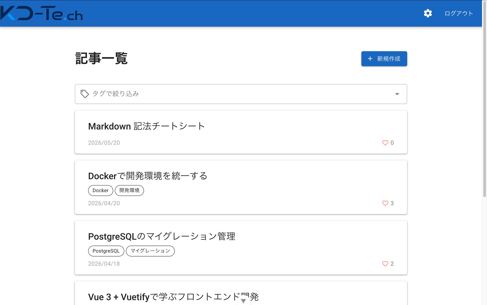
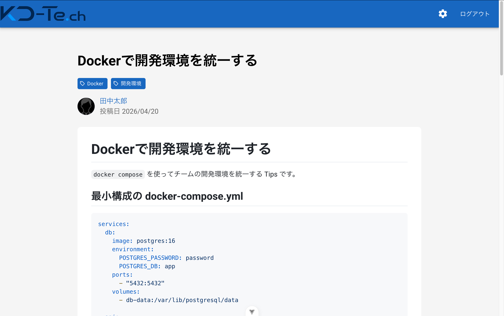
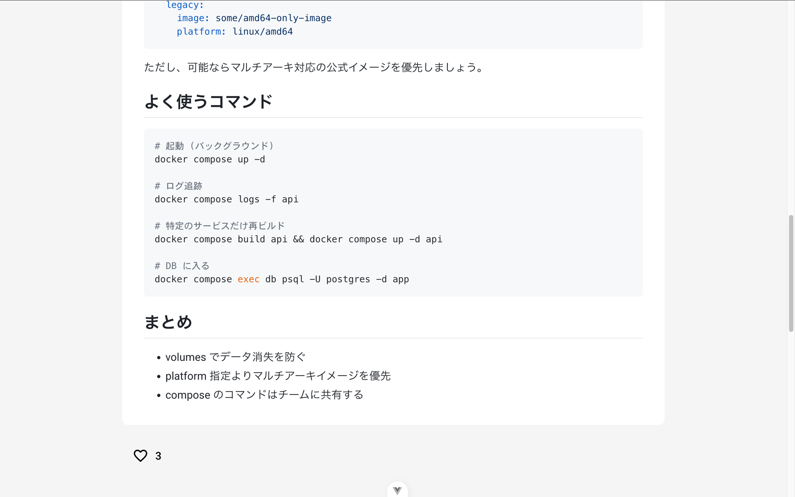
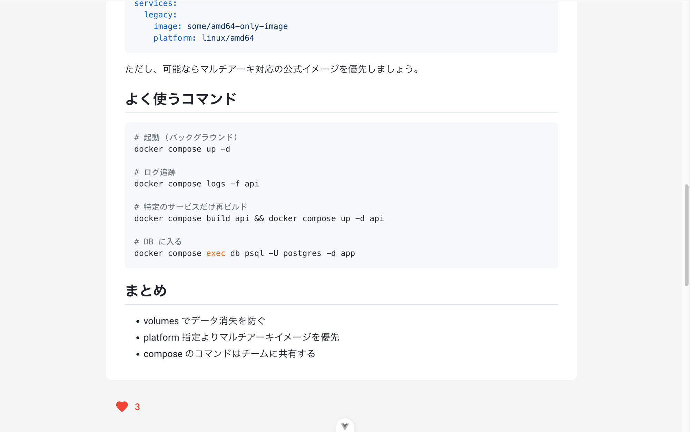
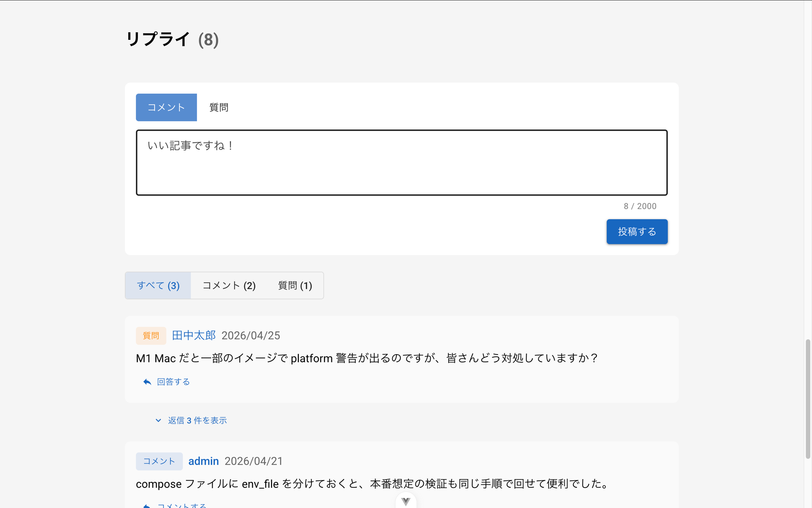
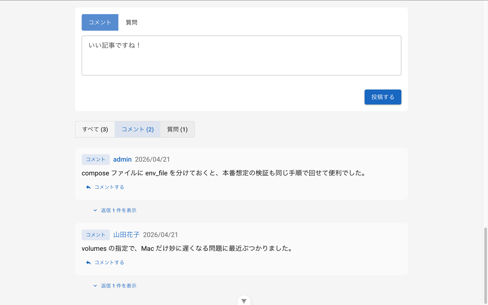
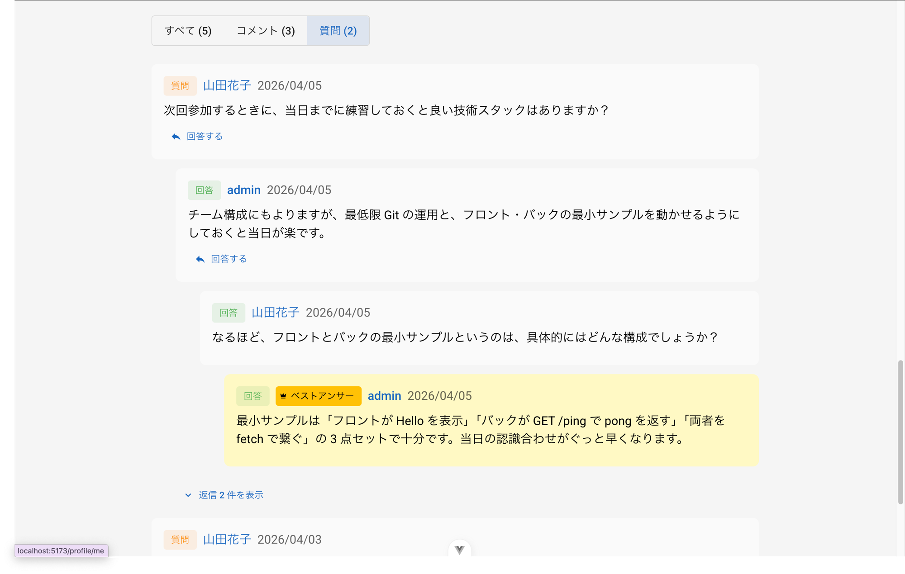
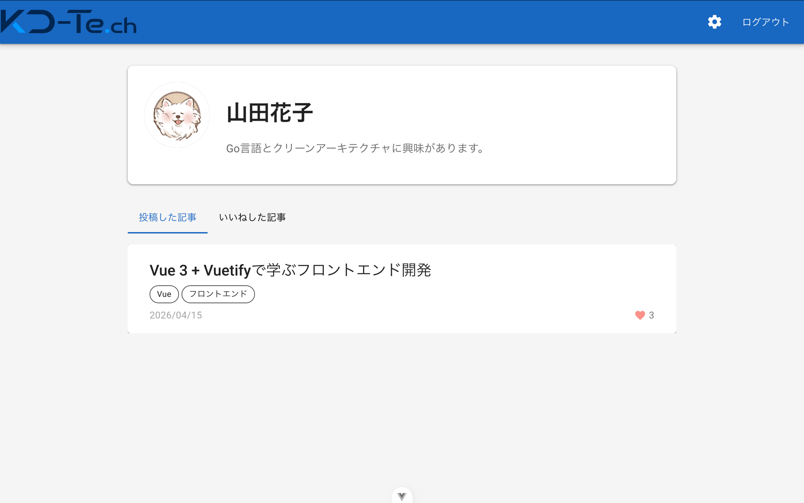
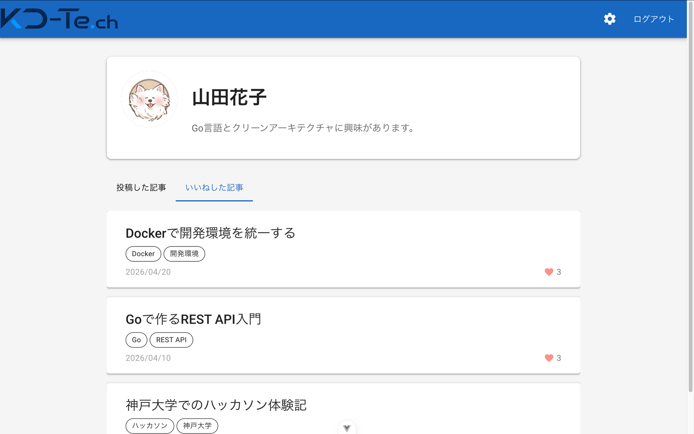

# KOBE-Tech README

神戸電子専門学校 ソフト4 チーム制作（1回目）で作成した Web アプリケーションです。
学生・教員が記事／質問／回答／制作物を投稿し、知識共有やフィードバックを行えるナレッジ共有サービスです。

## 目次

1. [実行環境](#1-実行環境)
2. [インストール方法（開発・実行に必要なツールの導入）](#2-インストール方法開発実行に必要なツールの導入)
3. [起動方法（git clone からローカルで動かすまで）](#3-起動方法git-clone-からローカルで動かすまで)
4. [デプロイ環境（公開URL）](#4-デプロイ環境公開url)
5. [簡単な操作方法](#5-簡単な操作方法)
6. [評価してほしいポイント](#6-評価してほしいポイント)
7. [苦労した点・工夫した点](#7-苦労した点工夫した点)

---

## 1. 実行環境

本アプリは Web アプリケーションのため、PC へインストールして使うソフトではありません。ブラウザからアクセスして利用します。
ローカルで動かす場合は、以下の環境で開発・動作を確認しています。

### 構成

| 領域 | 技術 |
| --- | --- |
| フロントエンド | Vue 3 / Vite / TypeScript / Vuetify / Pinia |
| バックエンド | Go 1.25 / Gin |
| データベース | PostgreSQL 16 |
| オブジェクトストレージ | MinIO（画像などのファイル保存） |
| API ドキュメント | Swagger / OpenAPI |
| 開発環境 | Docker Compose / mise（バージョン管理） |

### 採用バージョン

| ツール | バージョン | 備考 |
| --- | --- | --- |
| Go | 1.25.0 | |
| Node.js | v24.15.0 | LTS を採用 |
| PostgreSQL | 16 | Docker イメージで起動 |
| Docker | （任意の最新版） | Docker Desktop 推奨 |
| air | （最新版） | Go のホットリロード用 |
| swag | v1.16.4 | OpenAPI 生成用（任意） |

### 使用ポート

| ポート | 用途 |
| --- | --- |
| 5173 | フロントエンド（Vite 開発サーバー） |
| 8080 | バックエンド API サーバー |
| 5432 | PostgreSQL |
| 9000 | MinIO（API エンドポイント） |
| 9001 | MinIO（管理コンソール） |

---

## 2. インストール方法（開発・実行に必要なツールの導入）

Web アプリのため、アプリ本体のインストール作業はありません。
ローカルで動かすために、以下のツールを事前に導入してください。

> 導入済みであれば、各コマンドでバージョンが表示されることを確認してください。

### 2-1. Go（バックエンド）

公式: <https://go.dev/dl/>

```console
$ go version
go version go1.25.0 ...
```

### 2-2. Node.js（フロントエンド）

公式: <https://nodejs.org/>

```console
$ node --version
v24.15.0

$ npm --version
```

> バージョン管理ツール（mise / nvm / asdf 等）の利用を推奨します。推奨は mise です。

### 2-3. Docker / Docker Compose（DB・ストレージ）

Docker Desktop を入れると Docker / Docker Compose がまとめて揃います。
公式: <https://www.docker.com/products/docker-desktop/>

```console
$ docker -v
$ docker compose version
```

### 2-4. air（Go ホットリロード）

```console
$ go install github.com/air-verse/air@latest
$ air -v
```

### 2-5. swag（OpenAPI 生成 / 任意）

API 定義を再生成する場合のみ必要です。動作させるだけなら不要です。

```console
$ go install github.com/swaggo/swag/cmd/swag@v1.16.4
$ swag --version
```

---

## 3. 起動方法（git clone からローカルで動かすまで）

バックエンド（API + DB + ストレージ）とフロントエンドを、それぞれ別のターミナルで起動します。

### 3-0. リポジトリの取得

```console
$ git clone https://github.com/Baymax6s/KOBE-Tech.git
$ cd KOBE-Tech
```

### 3-1. バックエンドの起動

1. api ディレクトリへ移動

   ```console
   $ cd api
   ```

2. 環境変数ファイルを作成（`.env.example` から `.env` を生成）

   ```console
   $ make setup
   ```

3. 起動

   ```console
   $ make dev
   ```

   `make dev` は次の処理をまとめて行います。

   - Docker Compose で PostgreSQL / MinIO を起動
   - マイグレーション（テーブル作成）を自動実行
   - seed データ（初期ユーザー・サンプル記事など）を投入
   - air で API サーバーを起動（ホットリロード）

   API サーバー: <http://localhost:8080>

> DB だけ起動／停止したい場合
>
> ```console
> $ make db-up
> $ make db-down
> ```

### 3-2. フロントエンドの起動（別ターミナル）

1. app ディレクトリへ移動

   ```console
   $ cd app
   ```

2. 環境変数ファイルを作成

   ```console
   $ cp .env.example .env
   ```

3. 依存パッケージのインストール

   ```console
   $ npm install
   ```

4. 起動

   ```console
   $ npm run dev
   ```

   フロントエンド: <http://localhost:5173>

### 3-3. 動作確認

ブラウザで <http://localhost:5173> を開きます。
ログインを試す場合は、seed データの初期ユーザーを利用できます。

| ユーザー名 | パスワード |
| --- | --- |
| admin | Password |
| 田中太郎 | Password |
| 山田花子 | Password |
| 佐藤次郎 | Password |

**参考: 管理用コンソール**

- API ドキュメント (Swagger): <http://localhost:8080/swagger/>
- MinIO 管理コンソール: <http://localhost:9001>（Username: `minio` / Password: `password`）

---

## 4. デプロイ環境（公開URL）

公開URL: <https://vue-cjne.onrender.com/>

> 無料ホスティング（Render）を利用しているため、しばらくアクセスがないとサーバーがスリープ状態になります。
> 初回アクセス時は起動に時間がかかったり、一時的に表示が不安定になることがあります。その場合は少し待ってから再読み込みしてください。
> 基本的に自分のpcにcloneしてローカルで動かすこと推奨です。

---

## 5. 簡単な操作方法

### 5-1. 記事一覧を見る

アプリを開くと、まず「記事一覧」画面が表示されます。投稿された記事がカード形式で新しい順に並びます。
上部の「タグで絞り込み」から、興味のあるタグで記事を絞り込むこともできます。



### 5-2. 記事の詳細を見る

記事のカードをクリックすると、記事の詳細が表示されます。本文は Markdown で表示され、コードブロックなども見やすく整形されます。



### 5-3. 記事に「いいね」をする

記事の下部にある「いいね」ボタン（ハートアイコン）から、記事にいいねを付けられます。



いいねをするとハートが赤くなり、いいね数が増えます。もう一度押すと取り消せます。



### 5-4. 記事にコメント・質問をする

記事詳細のさらに下には「リプライ」欄があります。「コメント」と「質問」を選んで投稿できます。



リプライ欄は「すべて／コメント／質問」のタブで種類ごとに絞り込んで表示できます。



### 5-5. ベストアンサー

質問に対して付いた回答のうち、質問者は最も役立った回答を「ベストアンサー」に選ぶことができます。ベストアンサーは目立つ色で強調表示されます。



### 5-6. 他のユーザーのプロフィールを見る

記事の著者欄や、リプライ欄の投稿者名をクリックすると、そのユーザーのプロフィール画面に移動します。
プロフィールでは、そのユーザーが「投稿した記事」を一覧で確認できます。



タブを切り替えると、そのユーザーが「いいねした記事」も確認できます。



---

## 6. 評価してほしいポイント

### 6-1. 見た目の使いやすさ・きれいさ

UI には Vuetify という洗練されたデザインの仕組みを採用し、**スマホでもパソコンでも崩れずに見やすい画面**を目指しました。
記事はカード形式で並び、ボタンや色づかいを揃えることで、はじめて触る人でも迷わず操作できるようにしています。

### 6-2. 「知識を共有して、反応がもらえる」体験

記事を投稿するだけでなく、**「いいね」「コメント」「質問」「ベストアンサー」**といった、読み手が反応を返せる仕組みを揃えました。
質問に付いた回答の中からベストアンサーを選べるので、「誰かの疑問が解決していく」流れがそのまま記録に残ります。

### 6-3. 自分のページ（プロフィール）

ユーザーごとにプロフィール画面があり、**「投稿した記事」と「いいねした記事」**を一覧で振り返れます。
アイコン画像も自分で設定できるので、誰の投稿かが一目で分かり、コミュニティらしさが出るように工夫しました。

### 6-4. 読みやすい記事表示

記事の本文は見出し・箇条書き・プログラムのコードなどがきれいに整形されて表示されるので、技術的なメモや解説記事でも**読みやすくまとまる**ようにしています。

---

## 7. 苦労した点・工夫した点

### 7-1. チーム全員で作り上げたこと

このアプリは**複数人のチームで、100 回以上の改善を積み重ねて**完成させました。
担当を分けて開発を進めると、画面同士のつながりや細かな表示がズレてしまうことがよくありました。お互いの作業を確認し合い、少しずつ整えていく作業が一番大変で、同時にチーム開発ならではの学びになりました。

### 7-2. 「押した瞬間に反映される」気持ちよさ

「いいね」を押したらすぐにハートが赤くなる、タグで絞り込んだら一覧がすぐ切り替わる——こうした**操作した瞬間に画面が反応する**気持ちよさを大切にしました。
裏側では表示の食い違いが起きやすく、何度も調整を重ねて自然な動きに仕上げています。

### 7-3. デザインの統一

ボタンの形・色・余白などを画面ごとにバラバラにしないよう、**全体で見た目のルールを揃える**ことに気を配りました。
特にプロフィール画面やアイコンの編集まわりは、何度も作り直して使いやすさを整えています。

### 7-4. 公開して、誰でも触れるようにしたこと

作って終わりではなく、インターネット上に公開して**URL を開けば誰でも試せる**状態にしました。
無料のサービスで公開しているため、しばらく誰もアクセスしないと一時的に表示が遅くなることがあります（[4. デプロイ環境](#4-デプロイ環境公開url) に注意書きを記載）。安定して動かしたい場合は、手元のパソコンで動かす方法もご用意しています。
